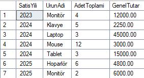
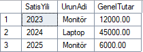
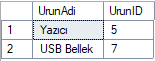

## Scenario:

In the HBYS system, the hospital pharmacy sells products. Sales and product details are stored in the following tables:

```sql
CREATE TABLE Urun (
    UrunID INT PRIMARY KEY,
    UrunAdi NVARCHAR(100),
    Fiyat DECIMAL(10,2)
);

CREATE TABLE Satis (
    SatisID INT PRIMARY KEY,
    UrunID INT FOREIGN KEY REFERENCES Urun(UrunID),
    Adet INT,
    SatisTarihi DATETIME
);
```

New Sample Data

```sql
INSERT INTO Urun (UrunID, UrunAdi, Fiyat) VALUES
(1, 'Laptop', 15000.00),
(2, 'Mouse', 250.00),
(3, 'Klavye', 450.00),
(4, 'Monitör', 3000.00),
(5, 'Yazıcı', 2000.00),
(6, 'Tablet', 5000.00),
(7, 'USB Bellek', 150.00),
(8, 'Hoparlör', 800.00);
```

```sql
INSERT INTO Satis (SatisID, UrunID, Adet, SatisTarihi) VALUES
(1, 1, 2, '2024-01-10 00:00:00.000'),
(2, 2, 5, '2024-01-15 00:00:00.000'),
(3, 1, 1, '2024-02-20 00:00:00.000'),
(4, 3, 3, '2024-03-05 00:00:00.000'),
(5, 2, 7, '2024-03-25 00:00:00.000'),
(6, 3, 2, '2024-04-12 00:00:00.000'),
(7, 4, 4, '2023-11-18 00:00:00.000'),
(8, 6, 3, '2024-05-02 00:00:00.000'),
(9, 8, 6, '2025-02-14 00:00:00.000'),
(10, 4, 2, '2025-03-20 00:00:00.000');
```

---

## Tasks:

### 1. Write a query that returns, per year and per product, the total sales amount (Fiyat \* Adet) and total quantity.

```sql
SELECT
    YEAR(satis.SatisTarihi) AS SatisYili,
    urun.UrunAdi,
    SUM(satis.Adet) AS AdetToplami,
    SUM(satis.Adet * urun.Fiyat) AS GenelTutar
FROM Urun urun

INNER JOIN Satis satis ON urun.UrunID = satis.UrunID
GROUP BY urun.UrunAdi, YEAR(satis.SatisTarihi)
ORDER BY SatisYili, urun.UrunAdi;
```



---

### 2. For each year, identify the product with the highest sales amount.

```sql
SELECT
    YilUrun.SatisYili,
    YilUrun.UrunAdi,
    YilUrun.GenelTutar
FROM (
    SELECT
        YEAR(satis.SatisTarihi) AS SatisYili,
        urun.UrunAdi,
        SUM(satis.Adet * urun.Fiyat) AS GenelTutar
    FROM Urun urun
    INNER JOIN Satis satis ON urun.UrunID = satis.UrunID
    GROUP BY YEAR(satis.SatisTarihi), urun.UrunAdi
) AS YilUrun

WHERE YilUrun.GenelTutar = (
    SELECT MAX(Toplam.GenelTutar)
    FROM (
        SELECT
            YEAR(satis2.SatisTarihi) AS SatisYili,
            urun2.UrunAdi,
            SUM(satis2.Adet * urun2.Fiyat) AS GenelTutar
        FROM Urun urun2
        INNER JOIN Satis satis2 ON urun2.UrunID = satis2.UrunID
        WHERE YEAR(satis2.SatisTarihi) = YilUrun.SatisYili
        GROUP BY YEAR(satis2.SatisTarihi), urun2.UrunAdi
    ) AS Toplam
)
ORDER BY YilUrun.SatisYili;
```



---

### 3. Write a query to list products that were never sold.

```sql
SELECT urun.UrunAdi, urun.UrunID
FROM urun
LEFT JOIN satis ON urun.UrunID = satis.UrunID
WHERE satis.UrunID IS NULL;
```


